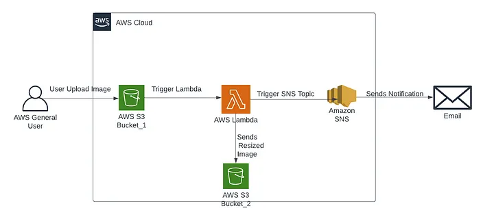
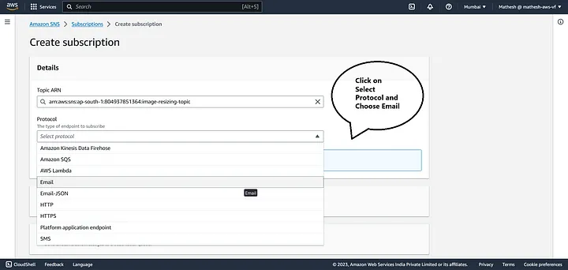
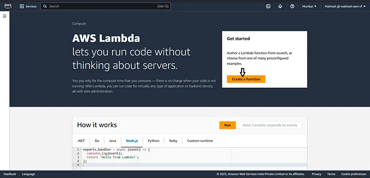
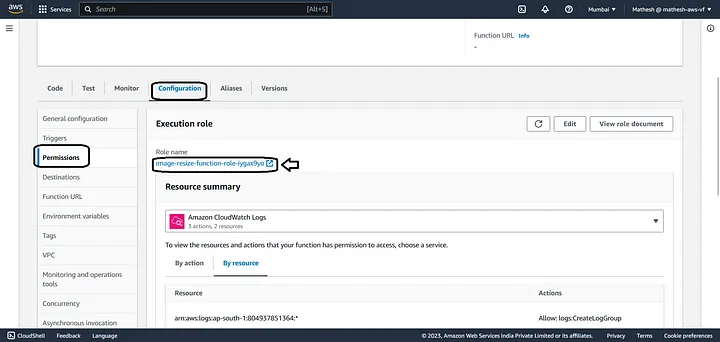

# Images automatically resizing Using Lambda Function




Project Description: 🚀
This project focuses on building an automated system for image processing and management within the AWS ecosystem. The goal is to streamline the handling of images by automatically resizing them and transferring them to a designated storage location while keeping stakeholders informed through notifications. Key AWS services, such as Lambda, S3, and SNS, are used to orchestrate this workflow.

## Project Details

1. Image processing automation: Automatically resize and optimize images upon upload.
2. Secure storage: Store processed images in a secure and reliable S3 bucket.
3. Real-time notifications: Receive immediate updates about image processing via SNS.
4. Scalable architecture: Design for scalability to handle image processing demands.
5. Cost-efficient solution: Leverage AWS serverless technologies to minimize operational costs.


### Step 1: Creating Source and Designation s3 Buckets :
- Navigate to the S3 Console.
- Create the source & destination bucket using the unique name.

.png)

### Step 2: Creating the SNS Notification :
- Navigate to the SNS console.
- Create Topic with a unique name

 .png)
 .png)

- Scroll down and Click Create subscription
- Select Protocol and choose Email

 

 .png)
 .png)

### Step 3: Creating the Lambda
- Navigate to the Lambda Console.



- give it a name, choose python and create lambda function
 .png)

- Now replace the default code with the image-resizing-s3.py and deploy the changes. After that , We have to give some permission for our Lambda Function to do our process (resizing)
### Step 4:  Role and Permission create on IAM Console
-  Navigate to the IAM Console
- Create role for lambda and give permission for s3, sns and lambda

.png)

 .png)
 .png)
 .png)

- Now navigate to the Lambda Console and attached created permission
 
 .png)

 -  Now we have to trigger the function.

 .png)
 .png)

### Step : Layer Add to the LAmbda Function
-  Now we have to go to code section , and scroll down to layers.
- We have to add layer because We need a python library called pillow in our code to resize the image 
- We Should add the arn from below for pillow library.

``` arn:aws:lambda:us-east-1:770693421928:layer:Klayers-p39-pillow:1 ```

.png)

-  After done all the actions above , now we can test our code.
.png)

### Step: Upload the images in S3 For resizing
- Navigate to the S3 Console
- Upload Some images in Source Bucket.
.png)
.png)

- Automatically Image upload on destination bucket and resized

.png)
.png)

- Finally We get Email noification
.png)


